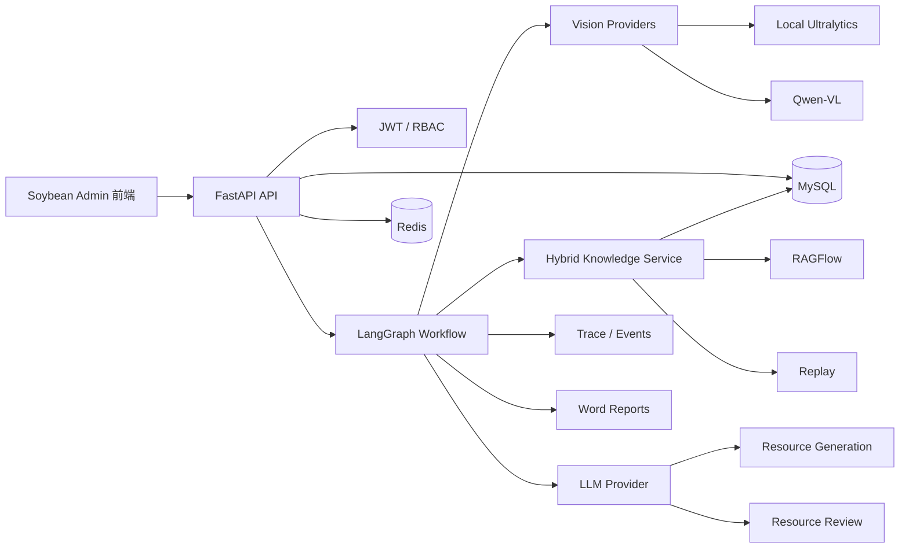

# 本草智策 HerbWise-AI

> 面向中药智能鉴别、临床药事质控实训与个性化学习的 AI 教学平台

本草智策（HerbWise-AI）是一套面向中药学教学、饮片识别、知识检索、学习路径生成与药事质控训练的智能化平台。项目通过本地视觉模型、Qwen-VL、多模型融合、RAGFlow 知识检索、LangGraph 工作流编排、结构化药材知识库与可追溯审核机制，将“识别—检索—生成—审核—学习路径—报告导出”连接为完整闭环。

当前版本在 V0.4 后端基线上加入了 Vue 学习者端、Soybean Admin 管理端、统一登录、本地 Ultralytics YOLO 识别和云端多模态视觉复核。后端仍保留 Mock、Fake、Replay 演示能力，真实模型凭据通过用户设置或本地环境变量配置，不进入 Git 仓库。

---

## 1. 项目目标

本项目主要解决以下问题：

1. **中药饮片识别训练**支持本地视觉模型、Qwen-VL 或双路并行识别，并对识别结果进行名称标准化和确定性融合。
2. **药材知识检索与证据追溯**结合 MySQL 中的结构化药材知识与 RAGFlow 非结构化文档检索，保留文档、章节、页码、Chunk 和引用信息。
3. **个性化学习路径**根据学习者画像、六维能力、历史任务和薄弱点，生成个性化学习资源与学习路径。
4. **资源生成与质量审核**支持讲义、指南、题目、对比卡片、复习报告等资源生成，并通过独立审核模型和确定性规则进行复核。
5. **任务全过程可解释**保存识别、融合、检索、证据、生成、审核、学习路径和模型调用信息，形成完整 Trace。
6. **比赛与离线演示**
   支持将真实成功任务保存为 Replay，在无网络、无模型 API、无 RAGFlow 的环境中离线回放完整任务流程。

---

## 2. 当前项目状态

| 模块                       | 状态   | 说明                                                     |
| -------------------------- | ------ | -------------------------------------------------------- |
| FastAPI 后端               | 已完成 | 单体分模块架构                                           |
| JWT 认证与 RBAC            | 已完成 | 支持管理员、教师、学生等角色                             |
| learner_id 数据隔离        | 已完成 | 学生跨用户访问返回 403                                   |
| 学习者画像                 | 已完成 | 支持六维能力与初始测试                                   |
| 药材结构化知识             | 已完成 | 药材、别名、性状、相似药材等                             |
| 本地视觉模型 Provider      | 已完成 | 支持 Ultralytics，惰性加载                               |
| Qwen-VL Provider           | 已完成 | OpenAI 兼容异步调用                                      |
| 双路识别融合               | 已完成 | 一致加分、冲突减分、人工复核                             |
| 资源生成与审核             | 已完成 | Mock/Real 两种模式                                       |
| RAGFlow Provider           | 已完成 | 适配器与 Fake/Mock 已完成，真实版本兼容性待环境验证      |
| Evidence 与 Citation       | 已完成 | 支持来源、页码、章节、Chunk 和引用                       |
| LangGraph 工作流           | 已完成 | 完整 full_loop                                           |
| Trace 证据链               | 已完成 | 识别到报告的全过程追踪                                   |
| Replay 离线演示            | 已完成 | 可捕获、验证和回放                                       |
| Word 报告导出              | 已完成 | 已实现演示级 DOCX 导出，正式模板排版和完整专业内容待完善 |
| OpenAPI 与前端交接         | 已完成 | API Freeze 与 Mock 数据                                  |
| GitHub Actions CI          | 已完成 | 自动运行测试、Ruff、mypy 等                              |
| Docker/PowerShell 运维脚本 | 已完成 | 启动、验证、备份、停止                                   |
| Vue 学习者端               | 已完成 | 画像、诊断、药材辨识、学习资源与证据链                   |
| Soybean Admin 管理端       | 已完成 | 统一登录后免二次认证进入管理端                           |
| 真实 RAGFlow 验证          | 待配置 | 需要 API 地址、Key、Dataset ID                           |
| 真实大模型验证             | 待配置 | 需要模型 API Key 和模型名                                |
| 本地模型接入               | 已完成 | 权重需本地放入 `data/models/`，类别映射已包含            |
| 正式中药资料导入           | 待完善 | 需要授权文档与正式类别映射                               |
| 摄像头实时视频识别         | 待开发 | 当前主要支持图片和任务式识别                             |

当前后端验证结果：

```text
pytest：89 passed，1 skipped
Ruff format：通过
Ruff check：通过
mypy：通过
Fake RAG Smoke：通过
Fake Evaluation：通过
Replay Smoke：通过
Degradation Smoke：通过
Repository Guard：通过
Alembic：单一 head
```

---

## 3. 核心功能

### 3.1 用户、角色与数据隔离

- JWT 登录与刷新令牌
- 数据库 RBAC
- 管理员、教师、学生、药师、质控人员等角色
- 学生只能访问自己的学习者画像、任务、识别记录、检索记录、资源、报告和 Trace
- 跨 learner_id 访问返回 HTTP 403
- 药材知识写操作仅限后台角色

### 3.2 学习者画像与能力诊断

- 学习者基本画像
- 六维能力记录
- 初始测试
- 薄弱知识点分析
- 学习路径生成
- 学习资源推荐
- 学习报告导出

### 3.3 中药图片识别

支持四种视觉模式：

| 模式       | 说明                               |
| ---------- | ---------------------------------- |
| `mock`   | 使用固定 Mock 结果，适合开发与演示 |
| `qwen`   | 使用 Qwen-VL 进行图片识别          |
| `local`  | 使用本地 Ultralytics 模型          |
| `hybrid` | 本地模型与 Qwen-VL 并行识别并融合  |

统一输出包括：

- 药材中文名
- 英文名
- 训练类别名
- Top-K 候选
- 置信度
- 性状证据
- 质控证据
- 不确定性
- 是否属于当前支持药材目录
- 是否需要人工复核

### 3.4 名称标准化

识别结果不会直接作为最终药材名，而是通过数据库进行标准化。

匹配顺序包括：

1. `training_class_name`
2. 英文标准名
3. 中文标准名
4. 中文或英文别名
5. 规范化后的大小写、空格和标点匹配

别名不写死在业务代码中，统一维护在数据库。

### 3.5 双路识别融合

默认融合规则：

- 本地模型与 Qwen-VL 识别为同一药材：本地置信度增加 `0.15`，最大不超过 `0.99`
- 两者结果冲突：本地置信度减少 `0.15`，标记 `manual_review_required=true`
- Qwen 结果超出支持目录、本地模型有效：使用本地模型结果
- 本地模型失败、Qwen 有效：使用 Qwen 结果
- Qwen 失败、本地模型有效：使用本地模型结果
- 两路都失败：不伪造识别结果，任务进入失败状态

### 3.6 RAG 知识检索

支持四种 RAG 模式：

| 模式        | 说明                       |
| ----------- | -------------------------- |
| `mock`    | 使用 Mock Evidence         |
| `ragflow` | 调用真实 RAGFlow           |
| `hybrid`  | MySQL 结构化知识 + RAGFlow |
| `replay`  | 使用已保存的检索快照       |

检索流程：

1. 从 MySQL 读取结构化药材知识
2. 构造标准化检索查询
3. 调用 RAGFlow 或 Replay
4. 过滤低分证据
5. 去重
6. 排序
7. 截断
8. 持久化检索记录与 Evidence
9. 将 Evidence 传递给资源生成与审核模块

每条 Evidence 可包含：

- 文档名
- 文档 ID
- Chunk ID
- 页码
- 章节
- 内容摘要
- 相关度分数
- 来源类型
- 引用字符串
- 数据来源

### 3.7 资源生成与审核

可生成：

- 讲义
- 学习指南
- 练习题
- 相似药材对比卡
- 复习报告
- 学情报告

审核机制：

- 先执行确定性规则
- 再执行审核模型
- 校验 Evidence 是否存在
- 校验 Evidence 是否属于当前 Retrieval
- 校验引用是否跨任务
- 校验是否虚构页码
- 校验无证据时是否错误声称“根据《中国药典》”
- 自动重写最多一次
- 严重规则问题不能被模型静默改为通过

### 3.8 Trace 证据链

Trace 保存完整链路：

```text
图片上传
→ 视觉识别
→ 名称标准化
→ 双路融合
→ 知识查询构造
→ 结构化知识
→ RAG Evidence
→ 证据去重与排序
→ 资源生成
→ Citation 回填
→ 资源审核
→ 学习路径更新
→ 报告导出
```

Trace 中明确标记 `mock`、`real`、`hybrid`、`replay`、`fallback` 和 `manual_review_required`。

### 3.9 Replay 离线演示

真实任务成功后，可以保存为 Replay。

Replay 包含：

- Recognition
- Retrieval
- Evidence
- Resource
- Review
- Trace
- Agent 事件
- 节点耗时
- 模型名称
- Prompt 版本
- 数据来源

离线演示时：

- 不调用真实模型
- 不调用 RAGFlow
- 不要求本地权重
- 仍按原节点顺序回放
- SSE 可逐步接收事件
- 最终任务状态为成功
- 页面必须明确显示“Replay 演示模式”

### 3.10 Word 报告

支持导出：

1. 学情报告
2. 中药识别审核报告

报告内容可包括学习者信息、六维能力、薄弱点、学习路径、最近任务、识别结果、融合结果、Evidence、Citation、审核状态、Trace ID 和数据来源。

---

## 4. 技术架构



主要技术：

- Python 3.12
- FastAPI
- Pydantic
- SQLAlchemy 2.x Async
- Alembic
- MySQL 8
- Redis 7
- LangGraph
- httpx
- OpenAI Compatible API
- Qwen-VL
- Ultralytics
- RAGFlow
- 依赖标准库 `zipfile`/XML 的轻量级演示 DOCX 导出
- pytest
- Ruff
- mypy
- Docker Compose
- GitHub Actions

---

## 5. 目录结构

```text
HerbWise-AI/
├─ frontend/                         # Vue 3 学习者端
├─ admin-frontend/                   # Soybean Admin 管理端
├─ backend/
│  ├─ app/                         # FastAPI 后端
│  │  ├─ core/                     # 配置、异常、响应、权限
│  │  ├─ integrations/             # AI、视觉、RAGFlow 等 Provider
│  │  ├─ modules/                  # 业务模块
│  │  └─ workflows/                # LangGraph 工作流
│  ├─ migrations/                  # Alembic 迁移
│  ├─ scripts/                     # Smoke、诊断、导入、评测脚本
│  ├─ templates/reports/           # Word 报告模板
│  ├─ tests/                       # 自动化测试
│  ├─ .env.example
│  ├─ pyproject.toml
│  └─ uv.lock
├─ data/
│  └─ models/                        # 类别映射与本地模型放置说明
├─ docs/
│  ├─ frontend-handoff/            # 前端交接包
│  ├─ mock/                        # 接口 Mock
│  ├─ api-freeze-v0.4.md
│  ├─ pending-user-commands.md
│  └─ user-validation-checklist.md
├─ infra/ragflow/                  # RAGFlow 辅助脚本与说明
├─ scripts/                          # 后端、双前端及运维脚本
├─ compose.yaml
├─ compose.dev.yaml
├─ compose.demo.yaml
├─ .env.demo.example
└─ README.md
```

---

## 6. 环境要求

### 6.1 推荐方式：Docker Desktop

推荐环境：

- Windows 10 / 11
- Docker Desktop
- Docker Compose v2
- Git
- PowerShell 5.1 或 PowerShell 7
- Node.js 20.19 或更高版本
- npm 11 或兼容版本
- pnpm 10.5 或更高版本

建议 Docker Desktop 至少分配：

- 4 CPU
- 8 GB 内存
- 20 GB 可用磁盘空间

真实部署 RAGFlow 时建议增加到：

- 8 CPU
- 12–16 GB 内存
- 40 GB 以上可用磁盘空间

### 6.2 本地开发方式

不使用 Docker 时需要：

- Python 3.12
- uv
- MySQL 8.x
- Redis 7.x
- Git

安装 uv：

```powershell
powershell -ExecutionPolicy ByPass -c "irm https://astral.sh/uv/install.ps1 | iex"
```

验证：

```powershell
uv --version
python --version
```

---

## 7. 获取项目

```powershell
git clone <你的仓库地址>
cd HerbWise-AI
```

当前稳定后端基线：

```powershell
git switch main
git checkout v0.4.0
```

---

## 8. 配置环境变量

复制后端环境变量模板：

```powershell
Copy-Item backend\.env.example backend\.env
```

演示模式可复制：

```powershell
Copy-Item .env.demo.example .env.demo
```

不要提交真实 `.env`。

### 8.1 基础配置示例

```env
APP_ENV=development
APP_TIMEZONE=Asia/Shanghai

DATABASE_URL=mysql+asyncmy://herbwise:CHANGE_ME@db:3306/herbwise
REDIS_URL=redis://redis:6379/0

AI_MODE=mock
VISION_MODE=mock
LLM_MODE=mock
RAG_MODE=mock
RUN_MODE=real
```

### 8.2 模型 API 配置

```env
MODEL_API_BASE_URL=https://example.com/v1
MODEL_API_KEY=YOUR_API_KEY

QWEN_VL_MODEL=qwen-vl-model-name
GENERATION_MODEL=your-generation-model
REVIEW_MODEL=your-review-model

REAL_AI_TESTS_ENABLED=false
REAL_FULL_LOOP_TESTS_ENABLED=false
```

只有显式设置 `REAL_AI_TESTS_ENABLED=true`，相关诊断脚本才会真实调用 API。

### 8.3 RAGFlow 配置

```env
RAGFLOW_BASE_URL=http://localhost:9380
RAGFLOW_API_KEY=YOUR_RAGFLOW_API_KEY
RAGFLOW_DATASET_ID=YOUR_DATASET_ID
RAGFLOW_DATASET_NAME=HerbWise Knowledge

RAG_MODE=ragflow
REAL_RAG_TESTS_ENABLED=true
```

真实地址、端口和 API 路径以当前 RAGFlow 部署版本和项目适配器为准。

### 8.4 本地模型配置

```env
LOCAL_VISION_ENABLED=true
LOCAL_MODEL_TYPE=ultralytics
LOCAL_MODEL_PATH=/data/models/herbwise-yolo26s.pt
LOCAL_MODEL_DEVICE=auto
LOCAL_MODEL_IMAGE_SIZE=960
LOCAL_MODEL_CONFIDENCE_THRESHOLD=0.10
```

模型权重不进入 Git。请将修正类别名称元数据后的 45 类模型放在 `data/models/herbwise-yolo26s.pt`，Docker Compose 会将其挂载为 `/data/models/herbwise-yolo26s.pt`。当前已验证权重的 SHA256：

```text
BCC439F4D43A38A7445265779F328697FE197A8627C6E861042A969786498EBA
```

用户提供的原始 `data/models/yolo26s.pt` 同样只保留在本地，避免在 Git 历史中保存大型二进制权重。

### 8.5 Replay 演示配置

```env
RUN_MODE=replay
RAG_MODE=replay
DEMO_REPLAY_ENABLED=true
DEMO_REPLAY_CODE=competition-demo-v1
```

---

## 9. 快速启动

### 9.1 启动完整开发环境

在仓库根目录依次启动后端和双前端：

```powershell
Set-Location D:\HerbWise-AI
.\scripts\start-dev.ps1
.\scripts\start-frontend.ps1
```

启动完成后的地址：

```text
学习者端: http://localhost:5173
管理端:   http://localhost:9528
Swagger:  http://localhost:8000/docs
Health:   http://localhost:8000/health
```

### 9.2 单独启动后端

```powershell
.\scripts\start-dev.ps1
```

该脚本会检查 Docker，启动 FastAPI、MySQL 和 Redis，并执行 Alembic 迁移及 Seed。停止后端容器：

```powershell
.\scripts\stop-services.ps1
```

### 9.3 单独启动双前端

```powershell
.\scripts\start-frontend.ps1
```

脚本会执行以下操作：

1. 检查 Node.js、npm 和 pnpm。
2. 首次运行时安装缺失的前端依赖。
3. 后台启动 Vue 学习者端和 Soybean Admin 管理端。
4. 等待两个 HTTP 地址可访问后再返回成功。
5. 将运行日志写入 `.runtime/frontend/`。

可选参数：

```powershell
# 启动完成后打开学习者端
.\scripts\start-frontend.ps1 -OpenBrowser

# 依赖已安装时跳过安装检查，并使用自定义端口
.\scripts\start-frontend.ps1 -SkipInstall -UserPort 5174 -AdminPort 9529
```

停止双前端：

```powershell
.\scripts\stop-frontend.ps1
```

### 9.4 一键启动演示环境

```powershell
.\scripts\start-demo.ps1
```

默认使用安全的 Mock/Replay 模式，不会调用真实 API。启用真实环境检查：

```powershell
.\scripts\start-demo.ps1 -Real
```

### 9.5 手动启动后端

```powershell
docker compose up -d --build
docker compose ps
docker compose exec api uv run alembic upgrade head
docker compose exec api uv run python scripts/seed_data.py
```

---

## 10. 不使用 Docker 启动后端

```powershell
cd backend
uv sync
uv run alembic upgrade head
uv run python scripts/seed_data.py
uv run uvicorn app.main:app --reload --host 0.0.0.0 --port 8000
```

---

## 11. 项目运行模式

### Mock 开发模式

```env
VISION_MODE=mock
LLM_MODE=mock
RAG_MODE=mock
```

适合本地开发、前端联调、CI 和无网络演示。

### Hybrid 识别模式

```env
VISION_MODE=hybrid
```

同时使用本地视觉模型、Qwen-VL 和确定性融合。

### 真实 RAG 模式

```env
RAG_MODE=ragflow
```

要求 RAGFlow 可访问、API Key 已配置、Dataset 已创建、文档解析完成。

### Replay 演示模式

```env
RUN_MODE=replay
RAG_MODE=replay
```

不调用真实大模型、不调用 RAGFlow、不要求本地权重。

---

## 12. RAGFlow 配置与运行

相关资料：

```text
infra/ragflow/
docs/ragflow-deployment.md
docs/ragflow-dataset-setup.md
docs/ragflow-document-guidelines.md
docs/ragflow-version-lock.md
```

安装、启动、状态和停止：

```powershell
.\infra\ragflow\install-ragflow.ps1
.\infra\ragflow\start-ragflow.ps1
.\infra\ragflow\status-ragflow.ps1
.\infra\ragflow\stop-ragflow.ps1
```

停止脚本默认不会删除 Volume。

完成部署后：

1. 创建 Dataset
2. 获取 API Key
3. 获取 Dataset ID
4. 将配置写入 `.env`
5. 上传一份有授权的测试文档
6. 等待文档状态变为 `ready`
7. 执行诊断

```powershell
cd backend
uv run python scripts/ragflow_doctor.py --all
```

---

## 13. 真实模型与本地模型诊断

```powershell
cd backend

uv run python scripts/config_doctor.py --check all
uv run python scripts/config_doctor.py --json

uv run python scripts/ragflow_doctor.py --all
uv run python scripts/ai_provider_doctor.py --all
uv run python scripts/local_model_doctor.py --info
uv run python scripts/local_model_doctor.py --load
uv run python scripts/local_model_doctor.py --predict "D:\test\herb.jpg"

uv run python scripts/smoke_v03c_real.py
```

配置不完整时，真实脚本应输出 `SKIPPED`。

---

## 14. 文档注册与同步

```powershell
uv run python scripts/register_knowledge_document.py `
  --uploaded-file-id "file_xxx" `
  --dataset-code "default"

uv run python scripts/sync_knowledge_document.py `
  --document-code "doc_xxx"

uv run python scripts/check_knowledge_document.py `
  --document-code "doc_xxx"

uv run python scripts/verify_rag_citations.py `
  --medicine-name "黄芪" `
  --query "黄芪的性状和切面特征"
```

---

## 15. 药材类别映射导入

模板：

```text
docs/data-import/medicine-class-mapping.template.csv
```

预演：

```powershell
uv run python scripts/import_medicine_class_mapping.py `
  --file "D:\data\medicine-class-mapping.csv" `
  --dry-run
```

正式导入：

```powershell
uv run python scripts/import_medicine_class_mapping.py `
  --file "D:\data\medicine-class-mapping.csv"
```

脚本不会伪造缺失类别，也不会默认覆盖人工维护数据。

---

## 16. 保存与验证 Replay

```powershell
uv run python scripts/capture_demo_replay.py `
  --task-id "task_xxx" `
  --replay-code "competition-demo-v1" `
  --description "比赛完整演示链路"

uv run python scripts/verify_demo_replay.py `
  --replay-code "competition-demo-v1"

uv run python scripts/smoke_demo_replay.py
```

---

## 17. 报告导出

```http
POST /api/reports/learning/{learner_id}/export-word
POST /api/reports/tasks/{task_id}/export-word
GET  /api/reports/{report_id}/download
```

报告文件存储在受控目录，数据库只保存相对路径。

---

## 18. 测试与验收

一键验证：

```powershell
.\scripts\verify-backend.ps1
```

手动验证：

```powershell
cd backend

uv sync
uv run pytest -q
uv run ruff format --check .
uv run ruff check .
uv run mypy app

uv run python scripts/export_openapi.py
uv run python scripts/smoke_v03b_fake.py
uv run python scripts/evaluate_rag_retrieval.py --mode fake
uv run python scripts/smoke_demo_replay.py
uv run python scripts/smoke_degradation.py
uv run python scripts/repository_guard.py
```

当前测试基线：

```text
76 passed
```

真实服务验证：

```powershell
.\scripts\verify-real-services.ps1
```

---

## 19. 数据库备份与停止服务

备份：

```powershell
.\scripts\backup-database.ps1
```

停止：

```powershell
.\scripts\stop-services.ps1
```

默认不会删除数据库 Volume。

不要随意执行：

```powershell
docker compose down -v
```

该命令可能导致数据库和 Redis 数据丢失。

---

## 20. API 与前端联调

后端接口冻结：

```text
docs/api-freeze-v0.4.md
```

前端交接：

```text
docs/frontend-handoff/README.md
```

OpenAPI：

```text
docs/openapi.json
```

主要模块包括：

- `/api/auth`
- `/api/learners`
- `/api/tests`
- `/api/medicines`
- `/api/vision`
- `/api/knowledge`
- `/api/agent/tasks`
- `/api/resources`
- `/api/reviews`
- `/api/traces`
- `/api/reports`
- `/api/admin/knowledge`
- `/api/admin/rag`
- `/api/admin/demo-replays`

实际路径以 `docs/openapi.json` 和 Swagger 为准。

---

## 21. 安全说明

项目已经实现或约束：

- API Key 仅通过环境变量读取
- 不在接口中返回 Secret
- 不在日志中记录 Authorization Header
- 不记录图片 Base64
- 不提交模型权重
- 不提交 `.env`
- 不提交上传图片
- 不提交生成报告
- 不提交 RAGFlow 数据卷
- 不提交受版权保护的完整药典文档
- 学生数据按 learner_id 隔离
- 报告下载防目录穿越
- 文件上传进行 MIME 和路径校验
- Repository Guard 检查危险文件

运行：

```powershell
cd backend
uv run python scripts/repository_guard.py
```

---

## 22. 等待完善的功能

### 22.1 真实 RAGFlow 数据

仍需：

- 部署并锁定真实 RAGFlow 版本
- 创建正式 Dataset
- 导入有授权的中药资料
- 验证文档解析
- 验证 page_number、document_id、chunk_id
- 评估检索准确率
- 建立比赛 Replay

### 22.2 真实模型验证

仍需：

- 配置 Qwen-VL API
- 配置生成模型
- 配置审核模型
- 验证 JSON Schema 兼容性
- 评估延迟与调用成本
- 测试超时与降级

### 22.3 本地视觉模型

仍需：

- 提供正式权重路径
- 导入完整类别映射
- 验证实际类别数量
- 测试 Top-K
- 测试 CPU/GPU 回退
- 评估真实图片效果

### 22.4 正式知识数据

仍需完善：

- 药材标准名
- 英文训练类别
- 常用别名
- 性状特征
- 质控要点
- 炮制特征
- 相似药材
- 测试题
- 引用来源
- 版权状态

### 22.5 前端

当前版本已提供：

- 用户/管理员统一登录与身份选择
- 学习画像采集、初始诊断与学习目标管理
- 图片上传、摄像头锁帧和虚拟实训入口
- 本地 YOLO 候选、检测框和置信度展示
- 云端多模态 Top-3 复核与双路结果展示
- 药典依据、个性化资源、学习路径和证据链页面
- Soybean Admin 数据大屏、任务、模型调用及系统管理页面
- 管理端退出后返回统一登录页

生产部署前仍需补充浏览器端端到端测试、正式域名配置和静态资源发布流程。

### 22.6 后续可选能力

暂未纳入当前版本：

- 摄像头实时识别
- 视频流识别
- 模型在线训练
- 自动数据标注
- 3D 药材展示
- 课堂班级画像
- 生产级监控与告警
- 多租户
- Celery 分布式队列
- MinIO 对象存储
- 正式医疗合规认证

---

## 23. 常见问题

### Docker 命令不存在

```powershell
where.exe docker
docker version
docker compose version
```

典型路径：

```text
C:\Program Files\Docker\Docker\resources\bin
```

### API 容器启动但无法访问

```powershell
docker compose ps
docker compose logs api
```

### 数据库迁移失败

```powershell
docker compose exec api uv run alembic current
docker compose exec api uv run alembic heads
docker compose exec api uv run alembic upgrade head
```

### Seed 重复执行报错

Seed 应保持幂等：

```powershell
docker compose exec api uv run python scripts/seed_data.py
docker compose exec api uv run python scripts/seed_data.py
```

### 真实脚本输出 SKIPPED

```powershell
cd backend
uv run python scripts/config_doctor.py --check all
```

### 本地模型不可用

```powershell
uv run python scripts/local_model_doctor.py --info
```

检查 `LOCAL_VISION_ENABLED`、`LOCAL_MODEL_PATH`、权重文件、Ultralytics 依赖和 CUDA 状态。

---

## 24. 开发规范

提交前执行：

```powershell
cd backend
uv run pytest -q
uv run ruff format --check .
uv run ruff check .
uv run mypy app
uv run python scripts/repository_guard.py
```

建议分支：

```text
main
develop
feature/*
fix/*
docs/*
```

不要直接在 `main` 上开发。

---

## 25. 文档索引

| 文档           | 路径                                    |
| -------------- | --------------------------------------- |
| 前端交接       | `docs/frontend-handoff/README.md`     |
| API Freeze     | `docs/api-freeze-v0.4.md`             |
| 用户验收清单   | `docs/user-validation-checklist.md`   |
| 用户待执行命令 | `docs/pending-user-commands.md`       |
| RAGFlow 部署   | `docs/ragflow-deployment.md`          |
| Dataset 配置   | `docs/ragflow-dataset-setup.md`       |
| 文档规范       | `docs/ragflow-document-guidelines.md` |
| 数据库结构     | `docs/database-schema.md`             |
| 工作流         | `docs/workflow.md`                    |
| 枚举           | `docs/enums.md`                       |
| 错误码         | `docs/error-codes.md`                 |
| OpenAPI        | `docs/openapi.json`                   |

---

## 26. 免责声明

本项目当前定位为：

- 中药学教学
- 中药饮片识别训练
- 药事质控实训
- 课程设计
- 比赛演示
- AI 工程研究

本项目不用于替代执业医师、药师或质量检验人员的专业判断，不应直接用于临床诊断、处方、治疗决策或药品质量放行。

---

## 27. License

请根据团队实际情况补充开源协议。

若项目包含第三方模型、数据集、RAGFlow 或药典资料，请分别遵守其许可证、服务条款和版权要求。
