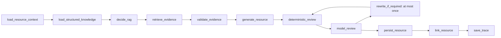

# 个性化学习资源智能体 + 条件 RAG + 专业审核闭环（Phase 3）

## 原流程与新流程

旧的资源接口直接调用资源生成器，并允许调用方自行提供药材名、检索 ID 和证据 ID。它保留为兼容接口 `POST /api/resources/generate`。新正式入口是 `POST /api/resource-generation-jobs`：调用方只给出学习计划项或学习任务，服务端读取学习者画像、目标知识点、近期表现和任务归属。



## 条件 RAG 与资源类型

支持的类型：`knowledge_card`、`comparison_card`、`error_explanation`、`review_summary`、`practice_guide`、`quality_control_case`、`professional_guide`、`detailed_comparison`。

`requires_citation=true`、专业资源（质量控制案例、专业材料、详细鉴别对比），或指令要求药典、标准、来源、原文、引用时，确定性 `RagDecisionService` 才会触发 RAG。知识卡、复习摘要、一般错题解释和基础练习指导默认只使用结构化知识。查询不包含 learner_id，最多五条；RAGFlow 的 mock、ragflow、hybrid、replay 模式继续复用现有 Provider。

## 输出、证据与审核

文字模型（仅 `purpose="text"`）输出受 Pydantic 约束的 JSON：目标、难度、预计时间、正文、练习、个性化原因与 Citation。Evidence 会按当前检索快照截断、去重并随资源保存；Citation 必须引用当前作业提供的 evidence_id。

确定性审核拒绝无效 Evidence、无 Evidence 的药典声明、缺少必需引用、提示词/凭据泄露、错误题目答案和越界目标。严重问题不能被模型审核覆盖。随后文字模型进行专业审核；仅一次重写，二次失败保存为 rejected，且不会关联计划项或任务。

## 数据与接口

迁移 `a4b5c6d7e8f9` 新增 `resource_generation_jobs`，并扩展 `resource_outputs`：计划/任务关联、学习目标、目标维度/知识点、预计时间、个性化原因、快照、引用数量、审核分数、版本、父版本和降级标记。

- `POST /api/resource-generation-jobs`
- `GET /api/resource-generation-jobs/{job_id}`
- `GET /api/resources?learner_id=...`
- `GET /api/resources/{resource_id}`
- `POST /api/resources/{resource_id}/retry`

仅 approved 资源会写入 `LearningPlanItem.linked_resource_id` 与任务资源关联。Trace 仅记录节点摘要、错误码、证据数量、数据来源和回退原因，绝不保存 API Key、Authorization Header、完整 prompt 或隐私数据。

## 回退、RAGFlow 与运维

文字模型不可用时，普通资源生成确定性模板，标记 `deterministic_fallback`；需要引用的资源不伪造 Citation，作业会降级。RAG 不可用也遵循同一原则。

真实 RAGFlow 需配置 `RAGFLOW_BASE_URL`、`RAGFLOW_API_KEY`、`RAGFLOW_DATASET_ID`（或名称）。Key 仅从环境/安全运行时读取，不能写数据库、Trace、日志或前端。部署前用现有 RAGFlow doctor 检查 Base URL、鉴权、Dataset、ready 文档、检索 Chunk 和 Citation 映射；不要自动导入无授权的《中国药典》全文。

## 前端与验证

资源库展示个性化原因、目标、时间、关联、RAG/Citation、审核、版本和数据来源。学习计划及任务页可发起资源作业，知识页仅在用户点击“为我讲解/生成对比卡”时发起，且要求先选择真实学习任务。

本地没有可解析的 MySQL `db` 主机时，迁移不能宣称已应用。Docker 环境执行：

```powershell
docker compose exec api uv run alembic upgrade head
docker compose exec api uv run alembic current
```

下一阶段可在此稳定资源、Evidence、审核和 Trace 契约上实现学习报告智能体。
